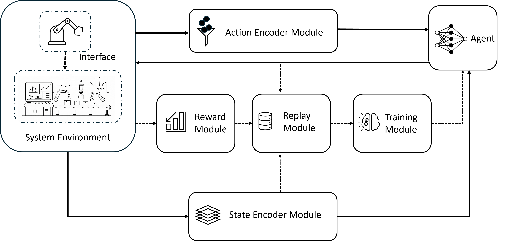
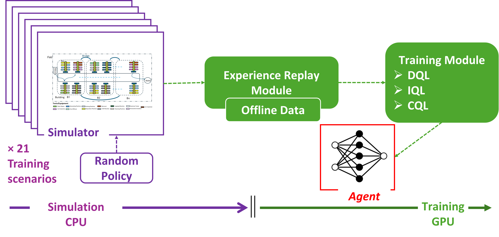
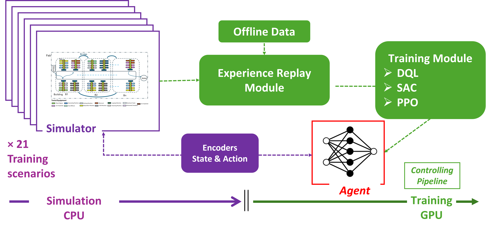

<h2 align="center">
    Event-driven Reinforcement Learning for Long-horizon Control in Asynchronous, Discrete-event Systems
</h2>

<p align="center">
  
</p>

<p align="center">
  <em>
    Modular event-driven RL architecture for policy interaction, representation, reward computation,
    replay, and training in asynchronous discrete-event systems.
  </em>
</p>

`EventDrivenTD-RL` is a modular reinforcement learning framework for systems where decisions are triggered by events rather than fixed time steps. It is designed for long-horizon control problems with delayed feedback, adaptive candidate sets, overlapping events, and system-level objectives.

The framework was developed in the context of event-driven reinforcement learning for semiconductor fabrication, but the public repository is intended to provide the **generic RL framework only**. It does **not** include proprietary industrial data, private simulator internals, confidential scenario files, or application-specific database schemas.

## Associated Paper

This repository accompanies the research framework described in:

**Event-Driven Reinforcement Learning Enables Long-Horizon Control in Semiconductor Fabrication**

The paper studies reinforcement learning for long-horizon control in event-driven systems, using semiconductor fabrication as a challenging representative application. The code in this repository is intended to provide the reusable RL framework independent of proprietary data and simulator internals.

<p align="center">
    <a href="https://arxiv.org/abs/2606.10705">📄 Read the Paper (arXiv:2606.10705)</a>
</p>

## Overview

Many real-world control systems are naturally event-driven:

- Manufacturing and production systems;
- Semiconductor fabrications
- Logistics and supply chains;
- Healthcare operations;
- Telecommunications and network control;
- Resource-constrained service systems;
- SimPy and discrete-event simulation environments;
- Digital-twin-based control systems.

In such systems:

- Dctions occur at irregular decision times;
- Actions may have variable duration;
- Multiple events may overlap;
- Feasible action sets may change at every decision;
- Local actions may influence delayed global objectives;
- Rewards may be sparse, delayed, or computed over time windows;
- One-step Markov transitions may be insufficient for credit assignment.

`EventDrivenTD-RL` addresses these issues by separating the reusable RL core from the application-specific environment through a modular adapter structure.

## Key Features

- Generic event-driven simulation interface
- SimPy-compatible adapter structure
- Candidate-set action selection with variable action spaces
- Event-level and group-level reward support
- Event-group temporal-difference learning
- Offline training from stored experience
- Online training through simulator interaction
- Generic encoder interfaces
- Generic reward-model interfaces
- Replay-buffer and sampler utilities
- Multiple model-free RL backbones
- Modular agent factory
- Generic placeholder system for testing package wiring
- Compatibility wrappers for migration from application-specific systems

The package separates:

```text
environment interaction
state/action encoding
reward construction
experience storage
experience sampling
event grouping
temporal-difference aggregation
policy optimization
logging and evaluation
```

## Training Modes

`EventDrivenTD-RL` supports two complementary training modes: **offline training** and **online training**. Both use the same modular RL core, including the encoder, reward, replay, sampler, and algorithm interfaces, but differ in how experience is generated and consumed.

<table>
  <tr>
    <td align="center" width="50%">
      
      <br/>
      <strong>Offline training</strong>
    </td>
    <td align="center" width="50%">
      
      <br/>
      <strong>Online training</strong>
    </td>
  </tr>
</table>

In **offline training**, the policy is learned from a fixed dataset of previously collected experience. The simulator or environment does not need to run during gradient updates: stored transitions are loaded, sampled through the replay/sampler interface, and used to train the agent efficiently. This mode is useful for pretraining, conservative offline RL, checkpoint selection, and learning when direct exploration is costly, risky, or unavailable.

In **online training**, the policy is improved through interaction with an event-driven simulator or system adapter. The environment generates new experience while the training process updates the agent from recent or replayed data. This enables policy synchronization, simulator-based fine-tuning, adaptive exploration, and continued improvement after offline pretraining. The design is efficient because simulation can run on CPU while neural-network optimization runs on GPU.

Together, the two modes support a practical workflow for long-horizon event-driven control: learn an initial policy from stored experience, then refine it through controlled online interaction.

| Mode | Experience source | Main use | Efficiency benefit |
|---|---|---|---|
| Offline | Fixed replay/logged data | Pretraining, conservative RL, model selection | No simulator interaction needed during training |
| Online | New simulator/system interaction | Fine-tuning, exploration, policy improvement | CPU simulation and GPU training can be pipelined |
| Offline → Online | Logged data followed by interaction | Safer initialization before online learning | Reduces inefficient exploration |

## Supported RL Backbones

The framework includes wrappers and agents for several reinforcement learning families in the different modes adopted by the proposed Aggregating Temporal Difference method:

| Algorithm family | Description |
|---|---|
| DQL / DDQN | Value-based learning with target networks |
| CQL | Conservative Q-learning for offline RL |
| IQL | Implicit Q-learning with value learning and advantage-weighted policy extraction |
| PPO-style methods | Clipped policy-gradient updates with event-driven advantage construction |
| SAC-style methods | Entropy-regularized actor-critic learning |
| Weighted TD | Weighted temporal-difference aggregation for event groups |
| Heuristic agents | Random, FIFO-style, and minimum-feature / SPT-style baselines |

*-- More could be integrated!*

## Requirements

Main dependencies:

```txt
torch>=2.4.1
numpy>=2.2.1
pandas>=2.2.3
simpy>=4.1.1
```

### Environment Setup

Using `venv`:

```bash
git clone https://github.com/YavarYeganeh/EventDrivenTD-RL.git
cd EventDrivenTD-RL

python -m venv .venv
source .venv/bin/activate

python -m pip install --upgrade pip
pip install -r requirements.txt
```

Using Conda:

```bash
git clone https://github.com/YavarYeganeh/EventDrivenTD-RL.git
cd EventDrivenTD-RL

conda create -n eventdriven-td-rl python=3.10 -y
conda activate eventdriven-td-rl

python -m pip install --upgrade pip
pip install -r requirements.txt
```

On Windows PowerShell:

```powershell
git clone https://github.com/YavarYeganeh/EventDrivenTD-RL.git
cd EventDrivenTD-RL

python -m venv .venv
.venv\Scripts\Activate.ps1

python -m pip install --upgrade pip
pip install -r requirements.txt
```

---

## Citation

Yeganeh, Y., Shekari, M., Frigerio, N., Pagano, D., & Matta, A. (2026). *Event-Driven Reinforcement Learning Enables Long-Horizon Control in Semiconductor Fabrication*. *arXiv preprint arXiv:2606.10705*.

```
@article{yeganeh2026event,
  title={Event-Driven Reinforcement Learning Enables Long-Horizon Control in Semiconductor Fabrication},
  author={Yeganeh, Yavar and Shekari, Mahsa and Frigerio, Nicla and Pagano, Daniele and Matta, Andrea},
  journal={arXiv preprint arXiv:2606.10705},
  year={2026}
  url={https://arxiv.org/abs/2606.10705}
}
```

## Contributing

Contributions are welcome. Feel free to contribute by improving the code, adding examples, extending documentation, fixing bugs, or proposing new event-driven RL components.

For bugs, questions, feature requests, or documentation problems, please open an issue on the GitHub repository.

When contributing, please keep the repository generic and avoid adding proprietary data, private simulator details, confidential scenario identifiers, or application-specific schemas.